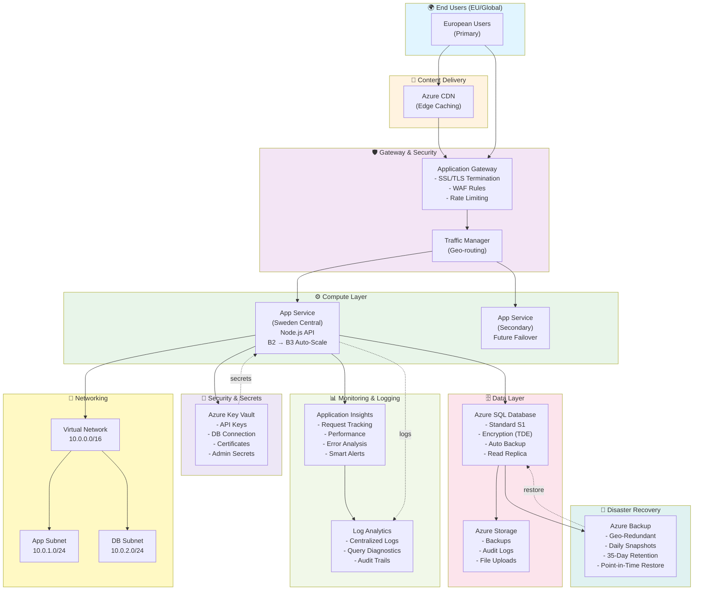

# Contoso Toyland - Azure Architecture Diagram

## Mermaid Diagram (Render as Image)



## Visual Architecture Tiers

```
┏━━━━━━━━━━━━━━━━━━━━━━━━━━━━━━━━━━━━━━━━━━━━━━━━━━━━━━━━┓
┃              🌐 PRESENTATION LAYER                      ┃
┃   React Frontend → Azure CDN → Application Gateway      ┃
┗━━━━━━━━━━━━━━━━━━━━━━━━━━━━━━━━━━━━━━━━━━━━━━━━━━━━━━━━┛
                              ↓
┏━━━━━━━━━━━━━━━━━━━━━━━━━━━━━━━━━━━━━━━━━━━━━━━━━━━━━━━━┓
┃              ⚙️ APPLICATION LAYER                       ┃
┃   App Service (Node.js/Express)                         ┃
┃   Auto-Scaling: B2 (Normal) → B3 (Peak)                ┃
┃   Regions: Sweden Central (Primary)                     ┃
┃             North Europe (Secondary/Future)            ┃
┗━━━━━━━━━━━━━━━━━━━━━━━━━━━━━━━━━━━━━━━━━━━━━━━━━━━━━━━━┛
                              ↓
┏━━━━━━━━━━━━━━━━━━━━━━━━━━━━━━━━━━━━━━━━━━━━━━━━━━━━━━━━┓
┃              🗄️ DATA LAYER                              ┃
┃   Azure SQL Database (Standard S1)                      ┃
┃   ├─ Toys (Inventory)                                  ┃
┃   ├─ Users (Admin Accounts)                            ┃
┃   ├─ Orders (Future)                                   ┃
┃   └─ OrderItems (Future)                               ┃
┃                                                         ┃
┃   Features:                                            ┃
┃   • Encryption at Rest (TDE)                          ┃
┃   • Encryption in Transit (TLS)                       ┃
┃   • Daily Auto-Backups                                ┃
┃   • Point-in-Time Restore (35 days)                   ┃
┗━━━━━━━━━━━━━━━━━━━━━━━━━━━━━━━━━━━━━━━━━━━━━━━━━━━━━━━━┛
                              ↓
┏━━━━━━━━━━━━━━━━━━━━━━━━━━━━━━━━━━━━━━━━━━━━━━━━━━━━━━━━┓
┃              🔐 SECURITY LAYER                          ┃
┃   ├─ Azure Key Vault (Secrets Management)              ┃
┃   ├─ WAF Rules (Application Gateway)                   ┃
┃   ├─ Network Security Groups (NSG)                     ┃
┃   └─ Azure AD / RBAC Access Control                    ┃
┗━━━━━━━━━━━━━━━━━━━━━━━━━━━━━━━━━━━━━━━━━━━━━━━━━━━━━━━━┛
                              ↓
┏━━━━━━━━━━━━━━━━━━━━━━━━━━━━━━━━━━━━━━━━━━━━━━━━━━━━━━━━┓
┃              📊 OPERATIONS LAYER                        ┃
┃   Application Insights → Log Analytics                 ┃
┃   ├─ Real-time Monitoring                              ┃
┃   ├─ Performance Analysis                              ┃
┃   ├─ Error Tracking & Alerts                           ┃
┃   └─ Compliance Auditing                               ┃
┗━━━━━━━━━━━━━━━━━━━━━━━━━━━━━━━━━━━━━━━━━━━━━━━━━━━━━━━━┛
```

## Component Interaction Flow

```
User Request Flow:
────────────────────────────────────────────────────────────

1. USER BROWSES CATALOG
   └─→ Browser Request
       └─→ CDN (Cached React App)
           └─→ Application Gateway (WAF Check)
               └─→ App Service (Node.js API)
                   └─→ SQL Database (Query Toys)
                       └─→ Response → Application Insights (Logged)
                           └─→ User's Browser


2. USER ADDS TO CART (State Management)
   └─→ Zustand Store (Client-side)
       └─→ No Backend Call (Local State)
           └─→ Application Insights (Event Tracked)


3. USER PROCEEDS TO CHECKOUT (Future)
   └─→ Browser Request → HTTPS Only
       └─→ Application Gateway (SSL Termination)
           └─→ App Service
               └─→ Key Vault (Retrieve Payment Secret)
                   └─→ Payment Processor
                       └─→ SQL Database (Insert Order)
                           └─→ Azure Backup (Automatic)
                               └─→ Response to User
```

## Deployment Architecture View

```
┌──────────────────────────────────────────────────────────┐
│              GitHub Repository (main branch)             │
└──────────────┬───────────────────────────────────────────┘
               │
               ▼
┌──────────────────────────────────────────────────────────┐
│           GitHub Actions CI/CD Pipeline                  │
│  ┌─────────────────────────────────────────────────┐    │
│  │ 1. Trigger: Push to main                        │    │
│  │ 2. Build: npm run build                         │    │
│  │ 3. Test: npm test                               │    │
│  │ 4. Lint: eslint src/                            │    │
│  │ 5. Deploy to Staging Slot                       │    │
│  │ 6. Run Smoke Tests                              │    │
│  │ 7. Swap Production Slot (Zero Downtime)         │    │
│  │ 8. Monitor Metrics for 5 minutes                │    │
│  │ 9. Auto-Rollback if Health Checks Fail          │    │
│  └─────────────────────────────────────────────────┘    │
└──────────────┬───────────────────────────────────────────┘
               │
       ┌───────┴────────┐
       │                │
       ▼                ▼
   Staging Slot    Production Slot
   (Blue Env)      (Green Env)
                       │
                       ▼
            Application Gateway
                       │
            ┌──────────┴──────────┐
            │                     │
            ▼                     ▼
         User Traffic        Monitoring
         (99% Success)       (Alert on Failure)
```

## High Availability & Disaster Recovery

```
┌─────────────────────────────────────────────────────┐
│          NORMAL OPERATION (99.9% Uptime)           │
└────────┬────────────────────────────────────┬───────┘
         │                                    │
    ┌────▼─────────────┐            ┌────────▼──────┐
    │  App Service     │            │  SQL Database │
    │  (Active)        │            │  (Primary)    │
    │  Sweden Central  │            │  Sweden       │
    │                  │            │  Central      │
    └────┬─────────────┘            └────────┬──────┘
         │                                   │
         └────────────────┬──────────────────┘
                          │
         ┌────────────────▼───────────────┐
         │   Azure Backup Service         │
         │   Daily Snapshots              │
         │   Geo-Redundant (To: NL)       │
         └────────────────┬───────────────┘
                          │
         ┌────────────────▼───────────────┐
         │   DISASTER EVENT               │
         │   (Region Failure/Data Loss)   │
         └────────────────┬───────────────┘
                          │
         ┌────────────────▼───────────────┐
         │   Restore from Backup          │
         │   RTO: 4 hours                 │
         │   RPO: 1 hour                  │
         │   Restore Location: NL Region  │
         └────────────────┬───────────────┘
                          │
         ┌────────────────▼───────────────┐
         │   Resume Operations            │
         │   (Temporary or Permanent)     │
         └────────────────────────────────┘
```

## Regional Distribution

```
                    🌍 GLOBAL VIEW

         ┌──────────────────────────────────┐
         │     NORTH AMERICA (Future)       │
         │  [Secondary Failover Region]     │
         └──────────────────────────────────┘
                         
                         
    ┌────────────────────────────────────────────┐
    │            EUROPE (Primary)                │
    │                                            │
    │  ┌──────────────────────────────────────┐ │
    │  │ 🟢 Sweden Central (Primary)          │ │
    │  │    ├─ App Service                    │ │
    │  │    ├─ SQL Database                   │ │
    │  │    ├─ Application Gateway            │ │
    │  │    └─ Key Vault                      │ │
    │  └──────────────────────────────────────┘ │
    │                     │                      │
    │                     ▼                      │
    │  ┌──────────────────────────────────────┐ │
    │  │ 🔵 North Europe / Netherlands (DR)   │ │
    │  │    ├─ Backup Storage                 │ │
    │  │    ├─ Geo-Redundant Copies           │ │
    │  │    └─ GDPR Compliant (EU Data)       │ │
    │  └──────────────────────────────────────┘ │
    └────────────────────────────────────────────┘
                         
                         
         ┌──────────────────────────────────┐
         │   ASIA PACIFIC (Future)          │
         │  [CDN Edge Locations]            │
         └──────────────────────────────────┘
```

## Scaling Timeline During Peak Season

```
Days 1-100 (Normal Traffic)
├─ App Service: 1 instance (B2 tier)
├─ CPU: 15-30%
├─ Database: S1 tier
└─ Concurrent Users: 100-150
   
Days 101-120 (Pre-Holiday)
├─ App Service: Auto-scales to 2 instances
├─ CPU: 50-70%
├─ Database: S1 tier
└─ Concurrent Users: 300-400

Days 121-140 (Holiday Peak)
├─ App Service: Auto-scales to 3 instances (B3 tier)
├─ CPU: 65-75%
├─ Database: Auto-scales to S2 tier
└─ Concurrent Users: 800-1000

Days 141+ (Post-Holiday)
├─ App Service: Scales back to 1 instance
├─ Database: Scales back to S1
└─ Returns to normal operation
```

## How to View These Diagrams

1. **Mermaid Diagram** (Above):
   - Copy the mermaid code block
   - Visit: https://mermaid.live
   - Paste and render as image
   - Export as PNG/SVG

2. **ASCII Art Diagrams**:
   - Use as-is in documentation
   - Copy to wiki pages
   - Include in README files

3. **Interactive Visualization**:
   - Use Azure Portal (visual blueprint feature)
   - Create custom visualization in draw.io or Lucidchart
   - Use the mermaid diagram as source

---

## Next Steps to Implement

1. **Deploy Infrastructure**: Use Bicep/Terraform templates
2. **Configure Monitoring**: Set up dashboards and alerts
3. **Set Up CI/CD**: GitHub Actions workflow
4. **Test Failover**: Verify disaster recovery procedures
5. **Performance Baseline**: Establish SLA metrics

Would you like me to create Bicep or Terraform templates to deploy this infrastructure?
